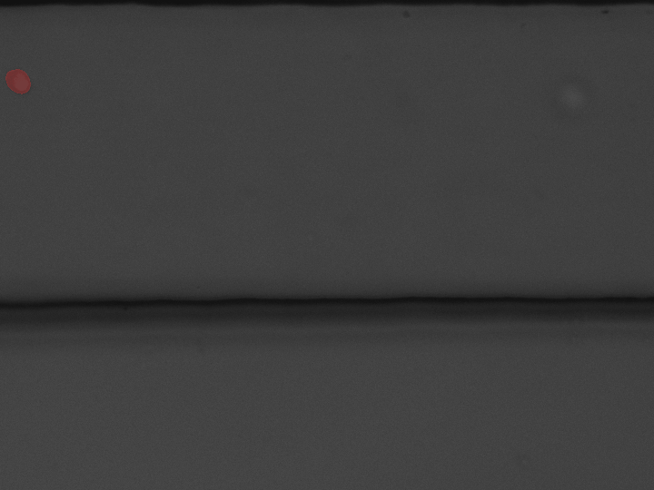
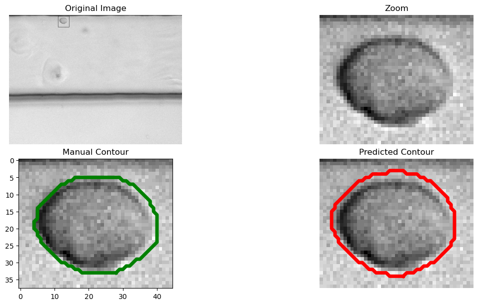
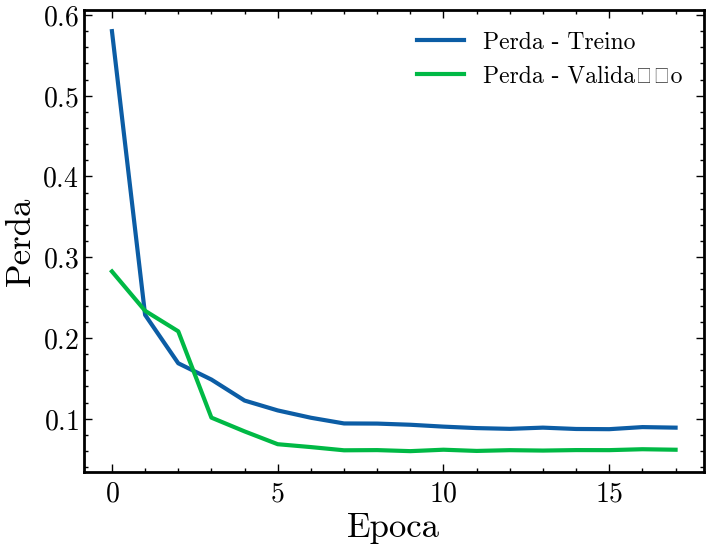
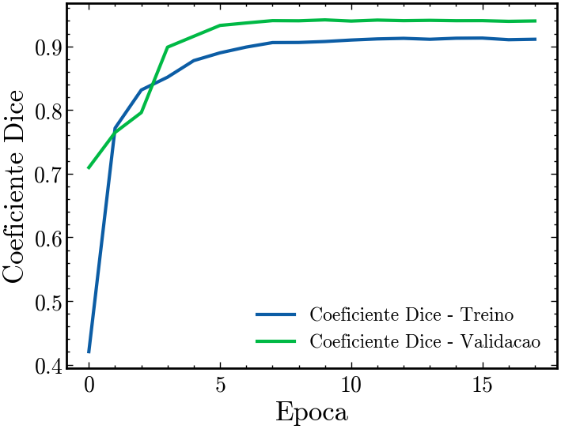

# Segmentação de Células em Imagens de Microscopia

Projeto de segmentação de células em imagens de microscopia sem contraste de fase utilizando uma arquitetura U-Net reduzida, combinada com Sliced Inference para lidar com forte desbalanceamento espacial dos dados.

# Visão Geral

O projeto tem como objetivo segmentar células provenientes de experimentos de microfluídica, possibilitando análises reológicas baseadas em deformação celular. Devido ao tamanho reduzido das células em relação à imagem completa, escolhi adotadar a técnica de Sliced Inference, que permite aumentar a proporção de pixels relevantes durante o treinamento, resultando em melhorias significativas na qualidade das máscaras preditas.

# Problema

- Imagens ruidosas devido ao aumento de ganho necessário para manter altas taxas de aquisição (FPS) sob limitações de iluminação do microscópio.
- Células ocupando uma fração extremamente pequena da imagem (≈ 0,2% da área total).
- Forte desbalanceamento entre pixels de fundo e objeto, dificultando a aquisição de mascaras com alta qualidade.

# Dados

- Modalidade: Microscopia óptica sem contraste de fase.
- Formatos: .png, .tif, .bmp.
- Resolução original: 720 × 540 pixel.
- Máscaras: Anotação manual binária.utilizando o software: <a href="https://github.com/bnsreenu/digitalsreeni-image-annotator">digitalsreeni-image-annotator</a>.

# Metodologia

## Pré-processamento

- Normalização por média e desvio padrão.
- Padronização de dimensões via recortes local.

## Data Augmentation

- Rotações.
- Flips horizontais e verticais.
- Deslocamentos em altura e largura.

## Arquitetura

- U-Net reduzida
- 5 níveis de encoder e decoder
- Número máximo de filtros: 512

## Função de Perda e Métrica

- Função de perda: Dice Loss
- Métrica principal: Dice Coefficient

## Estratégia de Slicing (Sliced Inference)

- Divisão das imagens originais em patches sobrepostos de 128 × 128 pixels
- Inferência local em cada patch utilizando a arquitetura U-Net reduzida
- Reconstrução da máscara final por fusão das predições sobrepostas, utilizando normalização pela contagem de contribuições por pixel.
- Aumento efetivo da proporção de pixels relevantes de 0.20% para 4,85% durante o treinamento

# Resultados
## Resultados Qualitativos

O Vídeo 1 apresenta uma sequência de imagens adquiridas diretamente do experimento de microfluídica e sua respectiva mascara em vermelho.

  
 
 <em>Vídeo 1 — Sequência temporal de imagens adquiridas diretamente do experimento.</em> 

A Figura 1 apresenta um frame bruto e um recorte ampliado de uma célula individual. O contorno em verde corresponde à máscara criada manualmente, enquanto o contorno em vermelho indica a segmentação predita pelo modelo.

  
 
 <em>Figura 1 — Frame original do experimento e zoom em uma célula individual.</em> 

# Construção do Dataset

Para contrução do Dataset, foram gerados recortes de 128 × 128 pixels, com as células centralizadas, formando os conjuntos de treino e validação, aproveitando as imagens ja rotuladas em seu tamanho original. Desta forma temos:

- Compatíbilidade com arquiteturas baseadas em downsampling por potências de 2

- Aumento na proporção de pixels relevantes para aproximadamente 4,85%

- Melhora significativa na estabilidade do treinamento

  
 
 <em>Figura 3 — Exemplos de imagens de treino e respectivas máscaras binárias.</em> 

## Métricas Quantitativas
A Figura 4 apresenta a evolução da função de perda durante as épocas de treinamento do modelo, revelando um comportamento estável e convergente. Observa-se uma redução rápida e contínua da perda ao longo das épocas iniciais, seguida por uma estabilização em torno da época 10, na qual o valor mínimo registrado foi de 0,0598.

  
 
 <em>Figura 4 — Curvas de perda para os conjuntos de treinamento e validação.</em> 

Em relação ao coeficiente Dice, o modelo atingiu um valor máximo de 0,9416 no conjunto de validação na mesma época. Durante o processo de treinamento, foi empregada a estratégia de redução da taxa de aprendizado (learning rate reduction) com paciência igual a 5 épocas, permitindo ajustes finos dos pesos após a estabilização inicial do desempenho.

  
 
 <em>Figura 5 — Curvas do coeficiente Dice para os conjuntos de treinamento e validação.</em> 
