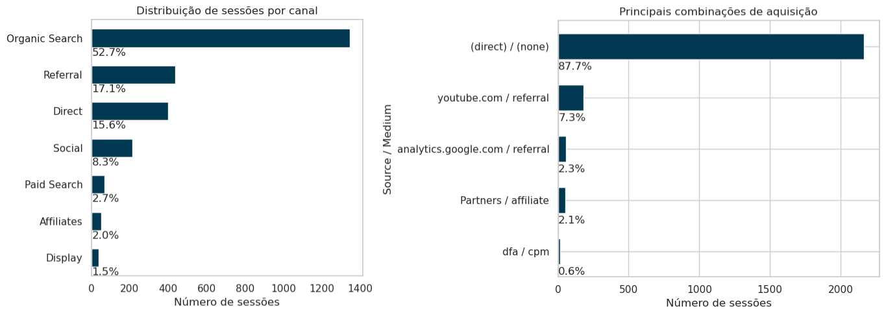
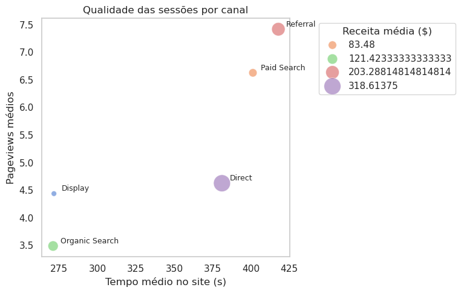

# Análise de Canais e Conversão - Google Analytics Sample

Este projeto realiza uma análise exploratória de dados do Google Analytics, utilizando o dataset público `ga_sessions_20170801` e `ga_sessions_20170701-29` O objetivo é responder perguntas de negócio sobre aquisição, engajamento e conversão de usuários em diferentes canais.

---

| Variável          | Tipo                  | Descrição                                                                                                                  |
| ----------------- | --------------------- | -------------------------------------------------------------------------------------------------------------------------- |
| `visitNumber`     | Inteiro               | Número da visita do usuário. Indica quantas sessões aquele visitante já realizou até aquele momento (1 = primeira visita). |
| `channelGrouping` | Categórica | Canal de aquisição agrupado pelo GA (ex: Organic Search, Direct, Referral, Social, Paid Search). |
| `source`          | Categórica | Origem do tráfego (ex: google, youtube.com, facebook.com).                                       |
| `medium`          | Categórica | Meio de aquisição (organic, cpc, referral, none).                                                |
| `pageviews`               | Inteiro                   | Número de páginas visualizadas na sessão.                                          | Proxy de engajamento. Valores altos indicam navegação mais profunda.                                                      |
| `bounces`                 | Binária (0 ou 1)          | Indica se a sessão foi um *bounce* (1 = saiu após uma única página sem interação). | Mede baixa interação. Alta taxa pode indicar tráfego pouco qualificado.                                                   |
| `transactions`            | Inteiro                   | Número de transações realizadas na sessão.                                         | Indicador direto de conversão.                                                                                            |
| `timeOnSite`              | Inteiro (segundos)        | Tempo total da sessão no site.                                                     | Outra métrica de engajamento. Pode ter assimetria forte (cauda longa).                                                    |
| `totalTransactionRevenue` | Numérico (micro-unidades) | Receita total gerada na sessão.                                                    | Variável alvo típica em modelos de revenue/conversão. No dataset do BigQuery vem em micros (÷ 1.000.000 para valor real). |

---

## Principais insights de negócios

**Quais canais trazem mais sessões?**

**Variáveis analisadas:**
- `trafficSource.source`
- `trafficSource.medium`
- `channelGrouping`

**Conclusões:**
- O canal **Organic Search** é responsável por **52,7%** das sessões, indicando bom desempenho de SEO.

- O canal `Direct` pode englobar tanto acessos diretos **intencionais** (como digitação do endereço ou favoritos) quanto tráfego não corretamente rastreado, oriundo de aplicativos de mensagens, e-mails ou ausência de parâmetros de campanha que não são corretamente rotulados. A análise complementar de `source / medium` reforça essas conclusões, evidenciando que a maior parte das sessões está classificada como `(direct) / (none)`, o que limita afirmações categóricas sobre o reconhecimento da marca.

- Os canais `Referral` e `Social`, que juntos somam **23,9%** das sessões, indicam uma presença consistente da marca em ambientes externos, como sites de terceiros e plataformas sociais, **sugerindo** potencial para estratégias de parcerias, distribuição de conteúdo e fortalecimento da presença digital. Entre as fontes identificáveis, destaca-se `youtube.com / referral`, sugerindo relevância da plataforma como canal de descoberta e geração de tráfego.

- Canais pagos (`Paid Search` e `Display`) apresentam baixa representatividade, sugerindo possível subinvestimento ou baixo retorno sobre o investimento (ROI).

**Gráfico:**  

  
 
 

---

## Quais canais trazem sessões de melhor qualidade?

**Qualidade = engajamento do usuário**

**Métricas analisadas:**
- `pageviews` médios
- `timeOnSite` médio (s)
- `totalTransactionRevenue` médio ($)

**Conclusões:**
- **Referral:** apresenta *pageviews* médio **7.42**, tempo médio no site **417.83 s** e receita média **$203.29**, caracterizando um canal com **alto engajamento e forte capacidade de conversão**. Isso indica que usuários chegam ao site por links externos que provavelmente já contextualizam o conteúdo, resultando em sessões mais engajadas.

- **Paid Search:** apresenta *pageviews* médio **6.63**, tempo médio **401.23 s** e receita média **$83.48**, indicando que, apesar do interesse inicial dos usuários, há limitações na conversão efetiva. Esse padrão é compatível com cenários em que a intenção de busca é predominantemente informacional, a segmentação das campanhas não está totalmente alinhada ao público-alvo, ou a experiência da landing page não direciona eficientemente o usuário para a ação final (compra).

- **Direct:** apresenta *pageviews* médio **4.63**, tempo médio **381.07 s** e receita média **$318.61**, destacando-se como o principal gerador de **receita média por sessão**, mesmo com níveis intermediários de engajamento.

- **Organic Search:** responsável por mais da metade das sessões, apresenta *pageviews* médio **3.49**, tempo médio **271.01 s** e o maior número absoluto de rejeições **715 bounces**. Ainda assim, contribui com um volume consistente de transações e receita média **$121.42**, refletindo seu papel estratégico como canal de **escala e descoberta** ao longo do ciclo de decisão do usuário.

- **Display:** baixo engajamento, com *pageviews* médio **4.44**, tempo médio **271.56 s** e receita média **$40.29**, sugerindo que o canal atua mais na **exposição inicial da marca** do que na conversão direta.

**Gráfico:**  

  
 
 

---

**Sessões com mais interações (pageviews) têm maior probabilidade de conversão? e durante os dias da semana? **

**Variável de interesse:** `pageviews`  
**Condição de conversão:** `transactions > 0`

**Resultados:**
- Tamanho dos grupos:
  - Sem conversão: 2513 sessões
  - Com conversão: 43 sessões
- Mediana de pageviews:
  - Sem conversão: 2.0
  - Com conversão: 23.0
- Estatística Mann-Whitney U: 2898.0  
- p-valor: 7.396e-30  
- Probabilidade de efeito (pageviews maiores nos grupos de conversão): 0.97

**Interpretação:**  
Sessões com maior número de pageviews estão fortemente associadas a conversões, mostrando que maior interação tende a aumentar a probabilidade de compra. Embora não seja possível afirmar causalidade direta, o padrão é estatisticamente robusto. 

Também confirmamos essa afirmação por meio da análise das medianas de pageviews por dia da semana, ao longo de um mês, que evidenciou uma associação entre volume de navegação e conversão. Sessões que resultaram em transação apresentam medianas entre 21 e 25 páginas visualizadas, enquanto sessões sem transação permanecem entre 1 e 2 páginas. Essa diferença é consistente em todos os dias da semana, indicando que o número de páginas visualizadas é um forte indicador de engajamento e está associado a uma maior probabilidade de conversão.

**Gráfico:**  

  
 
 

