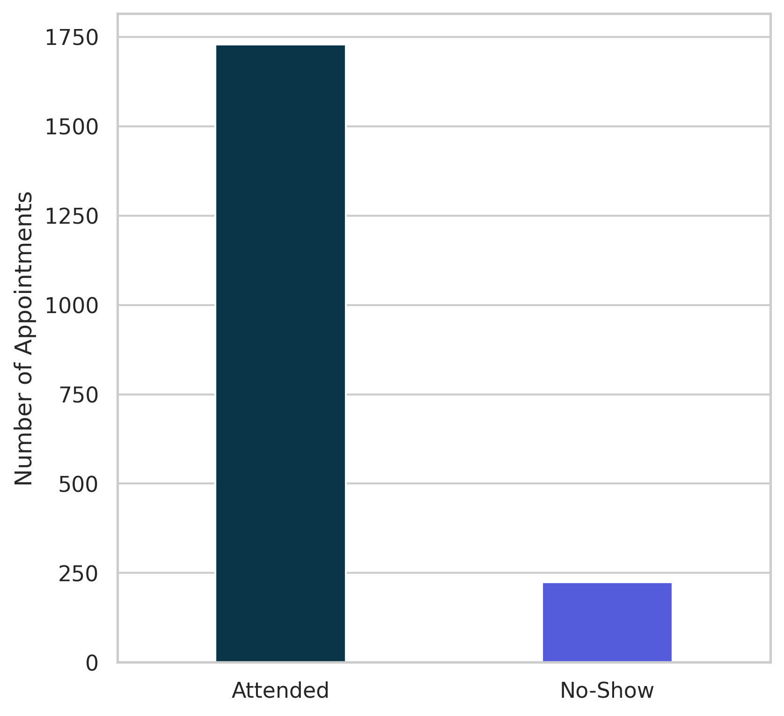
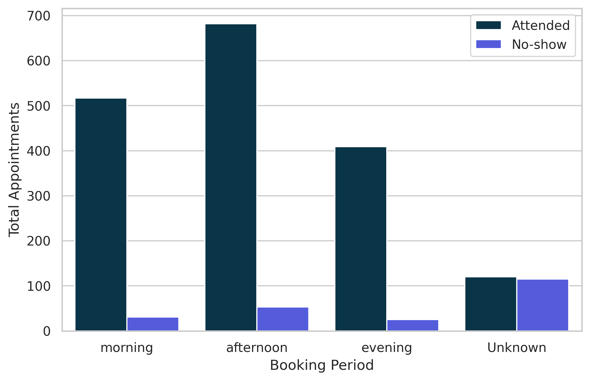
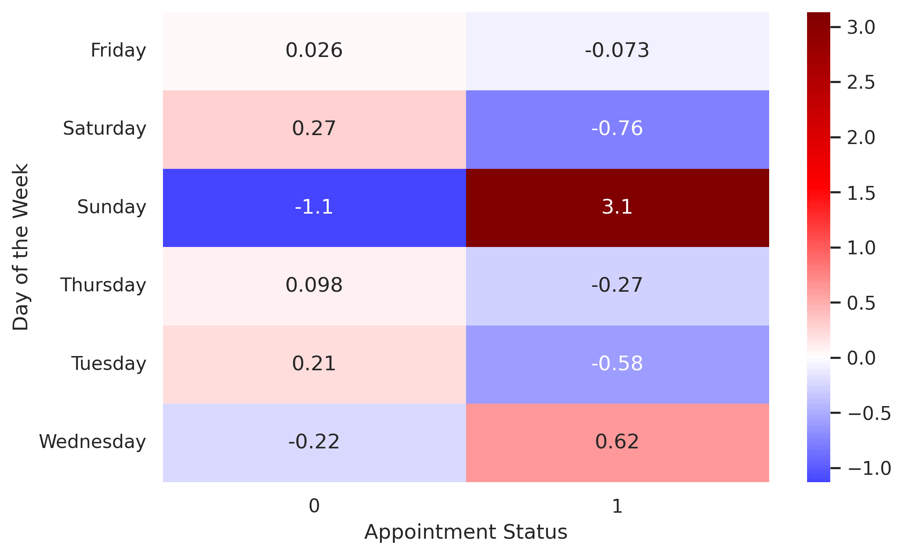
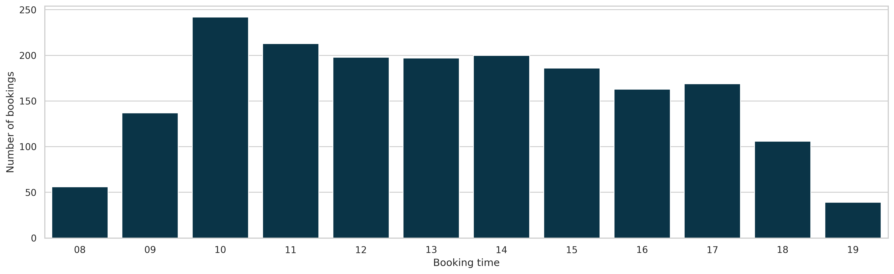
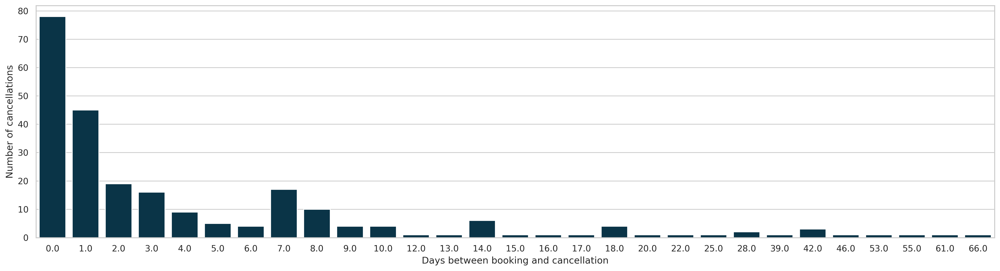
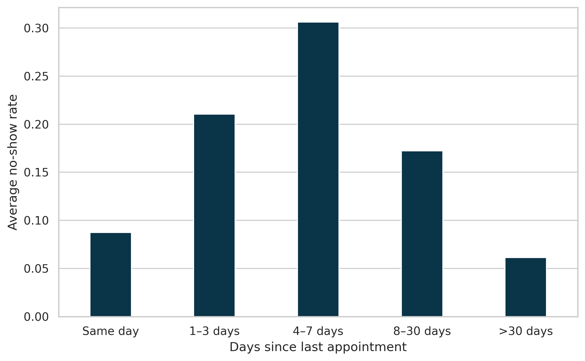
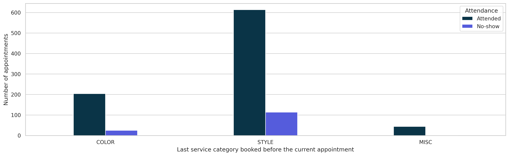

# Hair Salon No-Show Prediction

Prever faltas (*no-shows*) em agendamentos é um problema de grande impacto operacional e financeiro para salões de beleza. Este repositório contém uma solução de análise de dados e modelagem preditiva para identificar clientes com maior probabilidade de faltar, permitindo ações preventivas e mitigando perda de receita.  

---

##  Descrição
Este projeto tem como objetivo explorar e modelar o comportamento de clientes em relação a faltas em agendamentos (*no-shows*). Ele aborda:

- Análise exploratória dos dados
- Engenharia de features e tratamento de dados
- Comparação de modelos de machine learning
- Avaliação de métricas apropriadas para problemas desbalanceados
- Estimativa de impacto financeiro associada aos no-shows

---

## Dataset

Os dados utilizados foram fornecidos kaggle: <a href="https://www.kaggle.com/datasets/frederickferguson/hair-salon-no-show-data-set/data?select=hair_salon_no_show_wrangled_df.csv">[Hair Salon No-Show Prediction](https://www.kaggle.com/datasets/frederickferguson/hair-salon-no-show-data-set/data?select=hair_salon_no_show_wrangled_df.csv)</a>  e representam registros de agendamentos e atendimentos.  
As features utilizadas incluem:

- Horário e dia do agendamento
- Categoria do serviço agendado
- Histórico de atendimentos anteriores
- Indicadores de no-show e cancelamentos anteriores
- Informação de receita e número de serviços prestados

---


## Análise Exploratória de Dados

No notebook **01_data_exploration.ipynb** foram feitas as seguintes análises:

- Identificação e interpretação de valores ausentes
- Distribuição de faltas por período do dia e dia da semana
- Testes estatísticos (qui-quadrado) entre variáveis categóricas e no-show

---

## Engenharia de dados

No notebook **02_data_preprocessing_and_feature.ipynb** foram realizadas:

- Tratamento semântico de valores ausentes (ex: clientes sem histórico anterior)
- Criação de variáveis, tais como:
  - `noshow_rate` = taxa histórica de no-shows por cliente
  - `receipt_per_service` = receita média por serviço
- Seleção final de features para modelagem
- Salvamento do dataset final em `data/processed/`


---

##  Modelagem

O notebook **03_modeling_and_evaluation.ipynb** contém:

- Separação treino/teste
- Pipelines com pré-processamento (OneHotEncoder + StandardScaler)
- Comparação entre vários modelos:

| Modelo              | Recall (No-Show) | F1-Score (No-Show) | Accuracy |
|---------------------|------------------|--------------------|----------|
| Logistic Regression | 0.76             | 0.54               | 0.85     |
| Decision Tree       | 0.56             | 0.57               | 0.90     |
| Random Forest       | 0.60             | 0.60               | 0.91     |
| Gradient Boosting   | **0.64**         | **0.64**           | **0.92** |

O **Gradient Boosting Classifier** foi escolhido como modelo final por apresentar melhor equilíbrio entre recall, F1-Score e precisão na classe minoritária (*no-show*).


---

##  Métricas de avaliação de modelo

Para problemas desbalanceados como no-show, métricas como precisão **global** não são adequadas. As métricas principais utilizadas são:

- **Precision**: proporção de no-shows corretamente identificados entre os previstos
- **Recall**: proporção de no-shows verdadeiros que o modelo conseguiu identificar
- **F1-score**: média harmônica entre precision e recall


---
## Principais insights de negócios

Os principais insights obtidos a partir da Análise Exploratória de Dados, com foco em padrões de no-show (não comparecimento) e seus potenciais impactos no negócio do salão.

**O dataset apresenta forte desbalanceamento entre comparecimentos e no-shows**

- A análise inicial da variável alvo (noshow) revela um dataset altamente desbalanceado, onde a grande maioria dos agendamentos resulta em comparecimento.

- Para cada **1** no-show, existem aproximadamente **7.71** agendamentos atendidos, indicando que o evento de interesse é relativamente raro.

- Apesar disso, o impacto operacional do no-show é significativo, pois gera ociosidade, perda de receita e ineficiência no uso da agenda.

<p align="center">  </p> <p align="center"> </p>

**O período do dia não influencia a probabilidade de no-show**

Ao analisar o horário do agendamento (book_tod), observa-se que:

- O cálculo do p-valor resultou em `0.446,` indicando que não há evidência estatística suficiente para rejeitar a hipótese nula.

- Portanto, não é possível afirmar que o período do dia tenha influência significativa sobre a ocorrência de no-show.

<p align="center">  </p> <p align="center"> </p>

**O Domingo está associado a diferenças estatisticamente relevantes no no-show**

A distribuição de no-show ao longo da semana (book_dow) mostra que:

- O teste chi-quadrado resultou em **p-valor** = `0.026`, indicando a existência de diferenças estatisticamente significativas entre os dias da semana. 

- Análise dos resíduos padronizados mostrou que essa diferença é explicada pelo domingo, que apresenta mais no-shows do que o esperado. Os demais dias não apresentaram contribuições significativas.

- Esse insight pode apoiar decisões como remarcações estratégicas e realocação planeja.

<p align="center">  </p> <p align="center"> </p>

<p align="center">  </p> <p align="center"> </p>

**Horários específicos concentram maior volume de agendamentos**

A análise da variável Time evidencia que:

- A agenda do salão possui uma demada elevada no perido de `10h` as `15h`.

- Esses horários de maior concentração representam pontos críticos, onde o impacto de um no-show é mais elevado.

- Podem ser adotadas estratégias como o reagendamento de clientes com maior probabilidade de falta para horários de menor demanda, com o objetivo de reduzir o impacto operacional dos no-shows.

<p align="center">  </p> <p align="center"> </p>

**Cancelamentos tendem a ocorrer próximos à data do agendamento**

Ao analisar o intervalo entre agendamento e cancelamento (Days), observa-se que:

- A maioria dos cancelamentos ocorre com poucos dias de antecedência(primeira semana).

- Esse comportamento indica uma janela curta de reação operacional.

<p align="center">  </p> <p align="center"> </p>


**Taxa de no-show varia de forma não linear com a recência do cliente**


- Clientes que retornam em um intervalo muito curto (até 3 dias) tendem a apresentar menor probabilidade de falta, indicando maior comprometimento com o agendamento.

- Por outro lado, o grupo de 4 a 7 dias se destaca como o segmento mais crítico, sendo um alvo prioritário para ações preventivas

- Para clientes mais esporádicos (acima de 8 dias desde o último agendamento), a taxa de no-show volta a níveis semelhantes aos observados nos clientes mais recorrentes, sugerindo um comportamento mais previsível e estável.

<p align="center">  </p> <p align="center"> </p>

**O tipo do último serviço contratado não está associado ao no-show**

- O teste de independência entre a categoria do último serviço e a ocorrência de no-show não apresentou significância estatística (`p = 0.095`), indicando ausência de evidência suficiente para afirmar associação entre as variáveis.

<p align="center">  </p> <p align="center"> </p>

---
##  Impacto nos negócios

Sem qualquer modelo preditivo, os no-shows representam uma **perda potencial** de:

> **R$ 8.866,98**

Utilizando o valor do último serviço como estimativa da receita esperada, esse é o impacto financeiro associado aos no-shows no período analisado.

Com o modelo de **Gradient Boosting**, que apresenta *recall* de ~64% para a classe no-show, o salão seria capaz de identificar preventivamente cerca de dois terços dos casos de maior risco, viabilizando ações como:

- Confirmações antecipadas
- Remarcações estratégicas
- Ajustes na gestão da agenda

Isso permitiria **recuperar potencialmente** até **R$ 5.674,87** da receita que seria perdida.


---

## 🛠️ Como rodar

1. Coloque os dados originais em `data/raw/`
2. Execute:
   - `01_exploratory_analysis.ipynb`
   - `02_feature_engineering.ipynb`
   - `03_modeling.ipynb`
3. Visualize os resultados e gráficos nos notebooks

---

## Dependencias

Recomendado criar um ambiente Conda com:

```bash
conda create -n salon_ml python=3.10
conda activate salon_ml
conda install -c conda-forge scikit-learn pandas seaborn matplotlib imbalanced-learn

